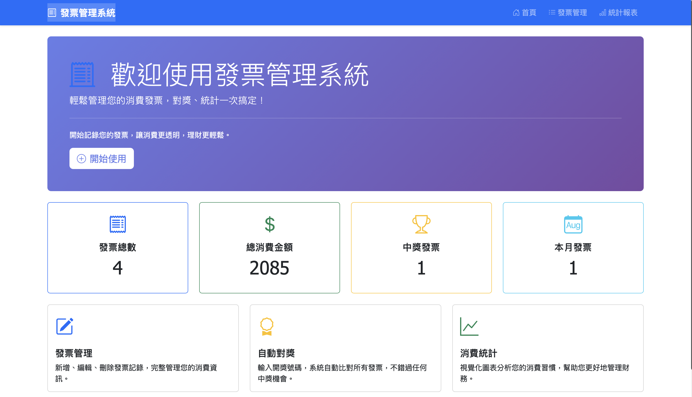
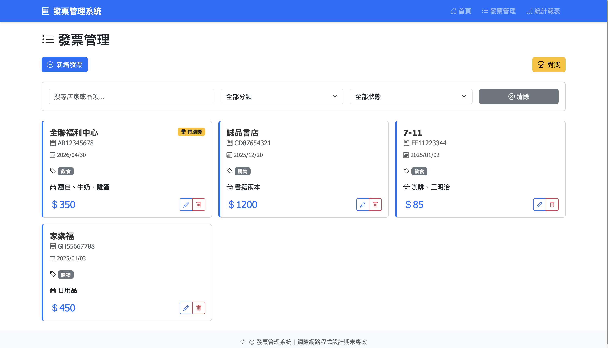
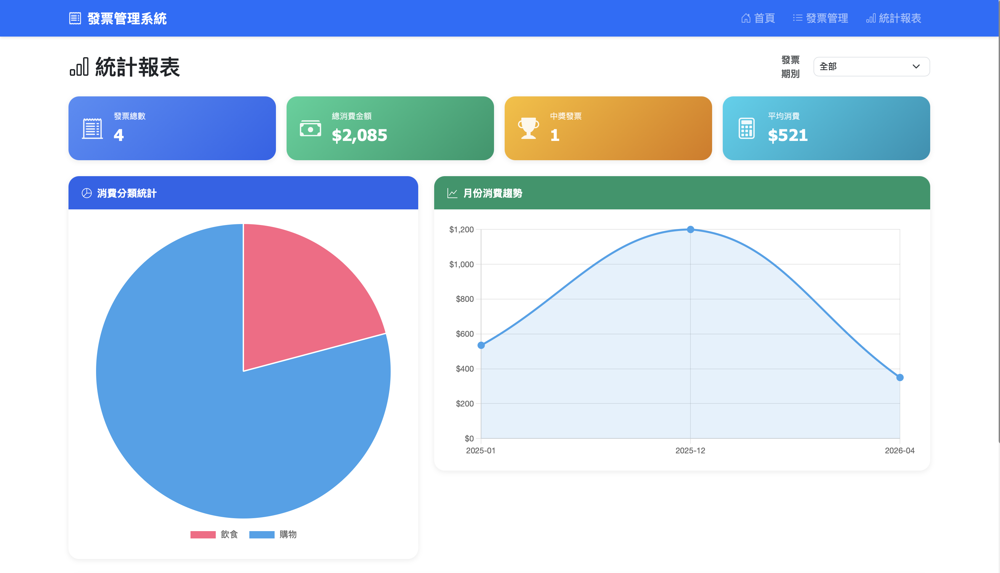
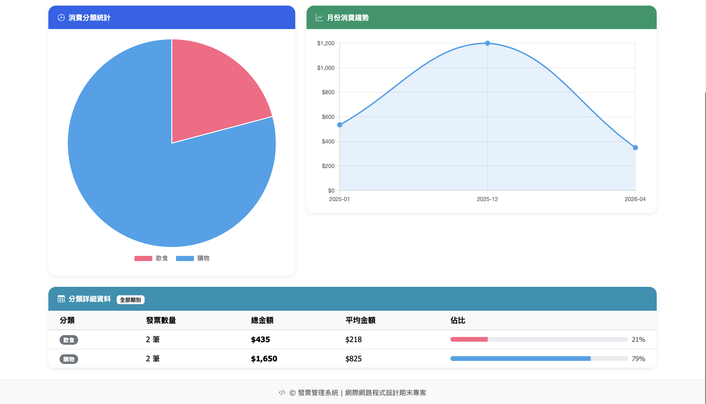
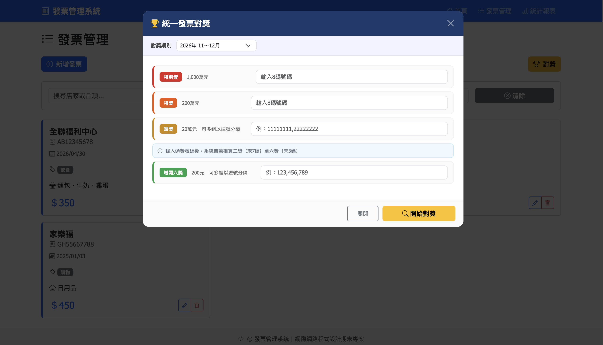

# 發票管理系統 💳

網際網路程式設計期末專案，以 Vue 3 + Node.js + Express 打造的前後端分離發票管理 Web App，提供發票記錄、自動對獎、統計分析等功能。

---

## 畫面截圖

### 首頁


### 發票管理


### 統計報表


### 消費分類圖表


### 發票對獎


---

## 功能特色

- 新增、編輯、刪除、查詢發票記錄
- 自動對獎：輸入開獎號碼，自動比對所有發票（支援特別獎、特獎、頭獎至六獎、增開六獎）
- 統計分析：以 Chart.js 視覺化呈現消費分類圓餅圖與月份消費趨勢折線圖
- 依發票期別（每兩個月一期）篩選統計資料
- 單頁式應用（SPA）：頁面切換不需重新整理
- 前後端分離架構：前端透過 Axios 呼叫 REST API

---

## 技術棧

**前端**

| 技術 | 說明 |
|------|------|
| Vue 3 | 前端框架 |
| Vue Router | 單頁路由管理 |
| Bootstrap 5 | UI 框架 |
| Chart.js | 統計圖表 |
| Axios | HTTP 客戶端，呼叫後端 API |

**後端**

| 技術 | 說明 |
|------|------|
| Node.js + Express | REST API 伺服器 |
| JSON 檔案 | 資料持久化儲存 |
| CORS | 跨域請求處理 |

---

## 專案架構

```
invoice-system/
├── src/
│   ├── views/
│   │   ├── Home.vue          # 首頁與統計摘要
│   │   ├── Invoices.vue      # 發票管理頁面
│   │   └── Reports.vue       # 消費統計與圖表
│   ├── components/
│   │   ├── InvoiceCard.vue   # 單張發票顯示元件
│   │   ├── InvoiceForm.vue   # 新增／編輯發票表單
│   │   └── LotteryCheck.vue  # 發票對獎功能
│   ├── services/
│   │   └── api.js            # Axios 封裝後端 API
│   ├── utils/
│   │   └── modal.js          # Bootstrap Modal 清理
│   ├── router/
│   │   └── index.js          # Vue Router 路由設定
│   ├── App.vue
│   └── main.js
├── server/
│   ├── server.js             # Express 後端伺服器
│   └── data/
│       └── invoices.json     # 資料儲存檔案
├── docs/                     # 截圖
├── index.html
├── vite.config.js
└── package.json
```

---

## 如何啟動

### 環境需求

- Node.js 16 以上
- npm

### 安裝依賴

```bash
git clone https://github.com/youzhen0827/invoice-system.git
cd invoice-system
npm install
```

### 啟動後端

```bash
node server/server.js
```

後端運行於 `http://localhost:3000`

### 啟動前端

開啟新的終端機視窗：

```bash
npm run dev
```

前端運行於 `http://localhost:5173`

---

## API 端點

| 方法 | 路徑 | 說明 |
|------|------|------|
| GET | `/api/invoices` | 取得所有發票 |
| GET | `/api/invoices/:id` | 取得單一發票 |
| POST | `/api/invoices` | 新增發票 |
| PUT | `/api/invoices/:id` | 更新發票 |
| DELETE | `/api/invoices/:id` | 刪除發票 |
| POST | `/api/check-lottery` | 發票對獎 |
| GET | `/api/invoices/stats/summary` | 取得統計資料 |

---

## 學習成果

- 實作 Vue 3 Composition API 與元件化開發
- 以 Vue Router 建立多頁面 SPA 架構
- 設計 RESTful API 並以 Express 實作前後端分離
- 整合 Chart.js 實現資料視覺化（圓餅圖、折線圖）
- 實作完整的 CRUD 操作與台灣統一發票對獎邏輯
